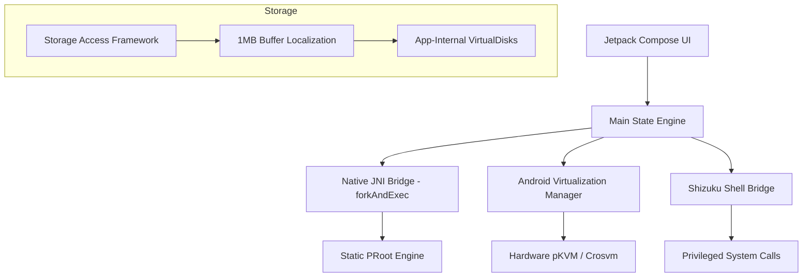

# AVF Simulator App (Baklava Edition)

A professional-grade, high-performance virtualization manager for Android 13-16+. This suite provides a unified interface for the **Android Virtualization Framework (AVF/pKVM)**, **QEMU**, and a Podroid-optimized **PRoot Engine**.

## 🚀 High-Performance Core

This "Remix" version incorporates several "intelligent" optimizations to bypass standard Android bottlenecks:

- **Ultra-Fast Storage Engine**: `StorageHelper.kt` utilizes a **1MB high-performance buffer** for SAF localization, enabling rapid transfers of multi-gigabyte ISO and Disk images.
- **Native JNI Isolation (C++)**: The `native-lib.cpp` bridge implements `prctl(PR_SET_PDEATHSIG, SIGTERM)`, ensuring that virtual machine processes are automatically cleaned up if the host application terminates, preventing "zombie" VMs.
- **Sparse Disk Generation**: Instantly create virtual disks (up to 100GB) that only occupy the actual space used on the physical storage.
- **Android 16 "Baklava" Ready**: Native support for API 36 capabilities, including granular pKVM capability detection (`isAnyVmTypeSupported`).

## 🛠 Architecture

## 📋 Features

- **pKVM Acceleration**: Hardware-backed virtualization with near-native performance.
- **Podroid-Style PRoot**: Direct CPU execution with optimized bind mounts (`/dev`, `/proc`, `/sys`) for Linux binaries.
- **Integrated Display & Touch**: Embedded noVNC viewer with optimized QEMU/Crosvm absolute pointer mapping (`usb-tablet`) for perfect touch control.
- **Smart Shizuku Logic**: Robust binder acquisition with version-aware reflection and automated permission granting for `USE_CUSTOM_VIRTUAL_MACHINE`.
- **Automatic Asset Management**: Built-in `DownloadHelper` to fetch static QEMU/PRoot binaries and lightweight OS images (Alpine, Debian) directly in-app.
- **WakeLock Persistence**: Foreground service with Partial WakeLocks to prevent Android's OOM killer from terminating active VMs.

## ⚠️ Troubleshooting for Developers

### Git "Fork Error" / Askpass Failure
If you encounter `dofork: child -1 ... exit code 0xC0000142` or `unable to read askpass response` during git operations in Android Studio/Windows:
1.  **Switch Credential Helper**: Run `git config --global credential.helper store`.
2.  **Reset Environment**: Clear `GIT_ASKPASS` and `SSH_ASKPASS` environment variables in your terminal.
3.  **Process Cleanup**: Kill all orphan `git.exe` and `sh.exe` processes via Task Manager.

### AVF Permission Denied
Ensure you have authorized the app via **Shizuku**. If `MANAGE_VIRTUAL_MACHINE` is missing, use the "KVM Rechte erteilen" button in the Status tab to trigger the Shizuku shell.

## 📄 Documentation

- [AGENTS.md](AGENTS.md): Core principles and technical standards for the project.
- [Diagnostic Guide](app/src/main/java/com/example/DiagnosticHelper.kt): Implementation details of the capability engine.

---
*Optimized for the next generation of mobile computing.*
